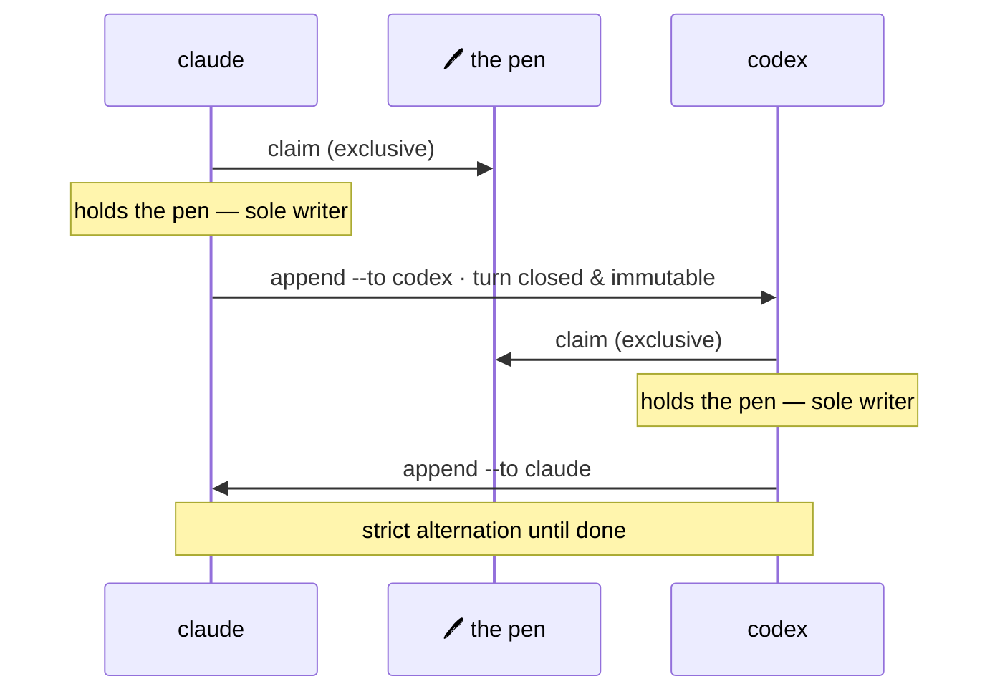

## Quick Start

<div class="m8-quickstart">
  <div class="m8-quickstart__bar">
    <div class="m8-quickstart__lights" aria-hidden="true">
      <span></span><span></span><span></span>
    </div>
    <div class="m8-quickstart__tabs">
      <span class="is-active">One-liner</span>
      <span>macOS &amp; Linux</span>
      <span>Windows</span>
    </div>
    <div class="m8-quickstart__badge">local install</div>
  </div>
  <div class="m8-quickstart__body">
    <p class="m8-quickstart__comment"><i class="fa-solid fa-shield-halved" aria-hidden="true"></i> Verifies the CLI + worktree toolbox, installs them locally, then runs init.</p>
    <pre><code><span class="m8-prompt">$</span> curl -fsSL https://raw.githubusercontent.com/M8Shift/M8Shift/main/install.sh | bash -s -- --verify --agents claude,codex
<span class="m8-prompt">PS&gt;</span> irm https://raw.githubusercontent.com/M8Shift/M8Shift/main/install.ps1 | iex</code></pre>
  </div>
  <div class="m8-quickstart__foot">
    <span><i class="fa-solid fa-fingerprint" aria-hidden="true"></i> SHA256-checked against the selected ref. No sudo. No global PATH change.</span>
    <a href="/guide/windows">Windows guide</a>
  </div>
</div>

## Coordination, not another agent platform

M8Shift is a coordination layer for AI agents already running in your terminal, IDE,
desktop application, or automation environment.

It is **free and open source**, released under the Apache License 2.0.

It does not need to become the model provider, the agent runtime, the project manager,
the chat application, and the coffee machine. It focuses on a narrower problem:
**making cooperative work explicit, serialized, and reviewable.**



*🟣 agents · 🩷 the pen*

## How a relay works

The examples use `claude` and `codex` because they are familiar defaults. They are
not special: replace them with `gemini`, `vibe`, or any cooperative agent that can
read its instructions, run the CLI, and follow `claim → work → append`.

In the simplest relay, two agents share one repository. The state lives at the top of a single file
(`M8SHIFT.md`), readable line by line:

```text
<!-- M8SHIFT:LOCK:BEGIN -->
holder: claude
state: WORKING_CLAUDE
agents: claude,codex
turn: 3
since: 2026-06-22T18:00:00Z
expires: 2026-06-22T18:30:00Z
lang: en
<!-- M8SHIFT:LOCK:END -->
```

The rule that makes it safe is one sentence: **never modify the repository before a
successful `claim`.** When an agent is done with its turn, it `append`s a handoff and
passes the pen to the other agent.

## What a handoff records

Each turn is a numbered block — once closed, it is never rewritten:

```text
<!-- M8SHIFT:TURN 4 claude BEGIN -->
from: claude
to: codex
ask: Implement the parser and keep legacy behaviour.
done: Defined the parser contract and added tests.
files: docs/spec.md, tests/test_parser.py
handoff: codex
<!-- M8SHIFT:TURN 4 claude END -->
```

Richer turn fields (`branch`, `commit`, `tests`, `next`, `blocked_on`, custom
`x_*` fields) are advisory metadata: M8Shift records them, but does not execute or
enforce them.

## Frequently asked questions

<p class="m8-section-lead">Common questions about M8Shift and how it works.</p>

<div class="m8-faq-strip">
  <a class="m8-faq-card" href="/faq#is-m8shift-model-agnostic">
    <i class="fa-solid fa-robot" aria-hidden="true"></i>
    <strong>Model-agnostic</strong>
    <span>Claude, Codex, Gemini, Vibe, local tools — any cooperative agent that can run the relay loop.</span>
  </a>
  <a class="m8-faq-card" href="/faq#does-m8shift-need-api-keys">
    <i class="fa-solid fa-key" aria-hidden="true"></i>
    <strong>No M8Shift API key</strong>
    <span>The core makes no model calls and stores no provider credentials. Your agent hosts keep their own auth.</span>
  </a>
  <a class="m8-faq-card" href="/guide/worktree-toolbox">
    <i class="fa-solid fa-code-branch" aria-hidden="true"></i>
    <strong>Parallelism via worktrees</strong>
    <span>One shared tree stays degree-1; isolated feature work uses the shipped worktree toolbox.</span>
  </a>
</div>

[Read the full FAQ →](/faq)

## Current status

M8Shift's shipped implementation and the planned protocol stages are labelled separately:

- **available now:** exclusive-claim relay, shared lock with stale-lock recovery, the
  immutable turn journal, bounded archiving, configurable roster, structured handoffs,
  `peek`, `recap`, `log`, `history`, `status --json`, `status --for`, `next`,
  `append --wait`, shared memory notes, task ledger, timezone-prefixed local-time
  display, and EN/FR generated output;
- **available as an opt-in companion:** [`m8shift-worktree.py`](/guide/worktree-toolbox)
  for isolated feature worktrees plus one serialized integration pen;
- **specified future RFCs:** hosted/runtime control plane and provider management as
  optional companions; true degree > 1 writes in one shared working tree as a research
  topic rejected for the core in favor of isolated worktrees.

[Read the roadmap →](/roadmap)
