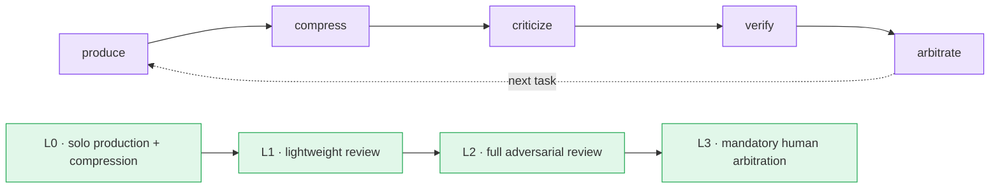

# M8Shift and the Compar:IA DNA

M8Shift belongs to the same intellectual lineage as [Compar:IA](https://comparia.beta.gouv.fr): the conviction that conversational AI models should be **compared** rather than trusted on faith. Compar:IA makes that comparison visible to a human evaluator — usually blind, usually pairwise. M8Shift takes the same conviction and turns it into a way of producing work.

  <i class="fa-solid fa-dna" aria-hidden="true"></i>
  

    <strong>The core message</strong>
    
M8Shift applies the Compar:IA DNA to AI-assisted production: <strong>model pluralism, adversarial review, context sobriety and human arbitration.</strong> It does not replace one AI with a bigger AI — it coordinates several agents under controlled conditions.

  

## From Model Comparison to Production Method

Compar:IA makes the plurality of answers visible: two models answer, and a human sees that fluent confidence is not the same thing as correctness. M8Shift makes that same plurality **operational** — instead of comparing two answers once, it organizes a controlled production chain where agents produce, criticize, verify, compress and arbitrate.

> Compar:IA shows why models should be compared.
> M8Shift shows how comparison can become a production method.

The shift is from *evaluation* to *workflow*: the same pluralism that Compar:IA surfaces for a rater becomes, in M8Shift, a property of how the work itself is done.

## Why the Single-Model Approach Is Not Enough

A single model can produce answers that are fluent but fragile. Left unchecked, one model working alone is exposed to a recognizable set of failure modes:

  

    <i class="fa-solid fa-ghost" aria-hidden="true"></i>
    <strong>Hallucination</strong>
    Invented facts stated with the same confidence as correct ones.
  

  

    <i class="fa-solid fa-question" aria-hidden="true"></i>
    <strong>Unchecked assumptions</strong>
    Premises taken as given that were never verified.
  

  

    <i class="fa-solid fa-eraser" aria-hidden="true"></i>
    <strong>Forgotten constraints</strong>
    Requirements stated earlier that quietly drop out of the answer.
  

  

    <i class="fa-solid fa-compress" aria-hidden="true"></i>
    <strong>Over-simplification</strong>
    The hard part smoothed over rather than solved.
  

  

    <i class="fa-solid fa-fingerprint" aria-hidden="true"></i>
    <strong>Implicit model preferences</strong>
    One model's stylistic and cultural priors presented as neutral.
  

  

    <i class="fa-solid fa-triangle-exclamation" aria-hidden="true"></i>
    <strong>Right but out of context</strong>
    Technically valid answers that are wrong for the actual situation.
  

None of these is a sign of a *bad* model — they are the ordinary risk of any single voice with no one to contradict it. The answer is not a larger model; it is a second, independent perspective.

## Adversarial Review by Design

M8Shift introduces adversarial review as a **workflow property**, not as an afterthought. It does not simply multiply agents — it separates responsibilities, so that the agent producing the work is not the only one judging it. Distinct roles carry distinct jobs:

  
<i class="fa-solid fa-pen-nib" aria-hidden="true"></i><strong>Producer</strong>Drafts the work.

  
<i class="fa-solid fa-magnifying-glass" aria-hidden="true"></i><strong>Critic</strong>Challenges it.

  
<i class="fa-solid fa-clipboard-check" aria-hidden="true"></i><strong>Verifier</strong>Re-runs the ground truth.

  
<i class="fa-solid fa-feather-pointed" aria-hidden="true"></i><strong>Compressor</strong>Reduces the handoff.

  
<i class="fa-solid fa-code" aria-hidden="true"></i><strong>Implementer</strong>Carries out the change.

  
<i class="fa-solid fa-vial" aria-hidden="true"></i><strong>Tester</strong>Exercises the result.

  
<i class="fa-solid fa-scale-balanced" aria-hidden="true"></i><strong>Arbitrator</strong>Decides what counts.

> Each agent does not merely produce output. It can also criticize, verify, contradict, reduce, test or reformulate the work of another agent.

This is where the Compar:IA instinct becomes structural: contradiction is designed in, and it is most useful when the agents are genuinely different — different model families tend to have less-correlated blind spots.

## Review Budget Gate

Adversarial review is powerful, but it is not free: every extra reviewing step costs tokens, latency and complexity. If review fired on every task, multi-agent work would collapse into noise and expense. So in M8Shift, adversarial review is **not triggered by default** — the system is one of *controlled escalation*.

  <i class="fa-solid fa-gauge-high" aria-hidden="true"></i>
  

    <strong>The Review Budget Gate</strong>
    
The Review Budget Gate decides when the expected value of an additional review step is higher than its cost in tokens, latency and complexity.

  

It is a decision principle, not a fixed threshold hard-coded into the engine. Escalation is warranted when the signals point that way:

- high task criticality;
- low confidence in the initial output;
- strong disagreement between agents;
- architectural or security impact;
- irreversible actions;
- missing sources;
- unverifiable assumptions;
- a high cost of failure relative to the cost of review.

> M8Shift does not use more agents because it can.
> M8Shift uses more agents when the task deserves it.

## Token Sobriety and Context Compression

Multi-agent orchestration has an obvious failure mode of its own: if it is badly designed, every handoff re-sends the whole history and the context balloons. In M8Shift, compression is a **design constraint, not cosmetics**. The orchestration is built to keep the context narrow:

- intermediate synthesis instead of raw transcripts;
- selective context transmission — only what the next agent needs;
- compressed handoff between turns;
- removal of irrelevant history;
- reduction of repeated prompts;
- monitoring of context width;
- cost-aware orchestration throughout.

  <i class="fa-solid fa-leaf" aria-hidden="true"></i>
  

    <strong>Why sobriety is a robustness question</strong>
    
Token compression is not only an economic optimization. It is a condition for robustness. A bloated context buries the signal a reviewer needs; a disciplined one keeps the contradiction sharp. M8Shift makes several agents work together without turning every task into a banquet of tokens.

  

There is a hard line here, and M8Shift respects it: compression must never starve verification. A handoff compressed so far that a reviewer can no longer check the work is a failure, not an economy.

## Compare, Challenge, Arbitrate

The whole method reduces to three moves — the backbone of the Compar:IA DNA in operational form.

### Compare

Do not assume a single model has the best answer.

### Challenge

Make adversarial review explicit between agents, models and specialized roles.

### Arbitrate

Do not confuse automatic consensus with truth. Final decisions must remain **traceable, explainable, auditable, and validated by a human when needed**. Two agents that simply agree — especially the same model — are an echo, not a safeguard.

## From Manifesto to Method

This page is the **positioning layer**: it says what M8Shift believes and why. A future technical companion will be the **implementation layer** — how those beliefs are encoded as agent contracts. That companion covers the per-agent contract files that give each agent an explicit, inspectable brief:

| Contract | What it declares |
| --- | --- |
| `SOUL.md` | identity and intent |
| `ROLE.md` | responsibilities |
| `TOOLS.md` | authorized capabilities |
| `POLICY.md` | review thresholds, escalation, arbitration |
| `MEMORY.md` | compressed context, persistent constraints, retained decisions |

The work moves through a loop — **produce → compress → criticize → verify → arbitrate** — with review applied at the level the task earns:

The review levels are a ladder, climbed only as far as the Review Budget Gate justifies: **L0** solo production with compression; **L1** a lightweight second look; **L2** full adversarial review; **L3** mandatory human arbitration for what is critical or irreversible.

## Short Formula

  <i class="fa-solid fa-quote-left" aria-hidden="true"></i>
  

    
One AI produces quickly. 
    Well-orchestrated agents produce better. 
    Challenged, compressed and arbitrated agents produce more soberly. 
    M8Shift is built on this conviction: robustness does not come from a single supposedly infallible model, but from a work system where answers are compared, challenged, compressed, verified and contextualized.

  

---

::: info Independent project
M8Shift is an independent open-source project. It is **not affiliated with, nor endorsed by, Compar:IA or beta.gouv.fr.** "Compar:IA DNA" here names a shared line of thinking — model pluralism and critical comparison — not any partnership. For the plain-language version of the same idea, see [M8Shift, simply](/beginners/m8shift-simply); for the reasoning on why contradiction between AIs helps, see [Why M8Shift](/guide/why).
:::
