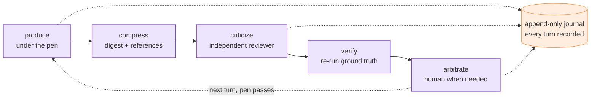

# Technical Companion — Agent Contracts, Review Gates and Context Compression

This is the companion to [M8Shift and the Compar:IA DNA](/manifesto/m8shift-comparia-dna). That page is the **positioning layer** — what M8Shift believes. This page is the **implementation layer** — how those beliefs map onto what M8Shift actually does.

  <i class="fa-solid fa-circle-info" aria-hidden="true"></i>
  

    <strong>Read this page honestly</strong>
    
The manifesto uses an idealized vocabulary — contract files, review levels, a budget gate. M8Shift does <em>not</em> ship all of that as literal files or coded thresholds. Below, each idea is paired with <strong>what M8Shift ships today</strong> versus <strong>what is still a design or a draft</strong>. Nothing here claims a measured performance gain; those require a case study, and none is asserted.

  

## Agent contracts: the idea and what ships

The manifesto describes a per-agent "contract" as five briefs — identity, responsibilities, capabilities, review policy, memory. These are a **way to think about the brief every agent already carries**, not five files M8Shift writes for you. Here is the honest mapping:

| Contract concept | What it declares | How M8Shift expresses it today |
| --- | --- | --- |
| `SOUL.md` — identity & intent | who the agent is | The **roster** and the generated **anchors** (a `CLAUDE.md` / `AGENTS.md` brief per agent). The curated **agents guide** is the canonical shared brief. |
| `ROLE.md` — responsibilities | what it is accountable for | Declarative **roles** on the roster; role separation (producer ≠ reviewer) is enforced socially by the guide, not by code. |
| `TOOLS.md` — authorized capabilities | what it may do | Advisory. M8Shift is a **cooperative** relay: it records intent and ownership; it does not sandbox or restrict what an agent's process can run. |
| `POLICY.md` — review thresholds, escalation, arbitration | when to escalate | A **discipline**, written in the agents guide — not a coded threshold engine. The routing and usage features (below) inform it; a human sets the bar. |
| `MEMORY.md` — compressed context, constraints, decisions | what to retain | Real and shipped: **memory notes** (`remember`), the append-only **turn journal**, and **decision records** (ADRs). |

  <i class="fa-solid fa-triangle-exclamation" aria-hidden="true"></i>
  

    <strong>Advisory, not a security boundary</strong>
    
Every "contract" above is <em>cooperative and advisory</em>. M8Shift coordinates agents that follow the protocol; it cannot stop a process that ignores it. This is a deliberate design choice — M8Shift has no model, no daemon, no network, and is not a sandbox.

  

## Review escalation levels

The manifesto's ladder — L0 to L3 — is a **conceptual model of how far to escalate review**, not a coded enum inside the engine. It describes a decision, and the decision is made by the agents and the human, informed by what M8Shift surfaces.

  

    <i class="fa-solid fa-1" aria-hidden="true"></i>
    <strong>L0 — solo production + compression</strong>
    One agent produces; the handoff is compressed. Enough for low-stakes, easily reversible work.
  

  

    <i class="fa-solid fa-2" aria-hidden="true"></i>
    <strong>L1 — lightweight review</strong>
    A second agent takes a quick pass. Cheap insurance against obvious misses.
  

  

    <i class="fa-solid fa-3" aria-hidden="true"></i>
    <strong>L2 — full adversarial review</strong>
    An independent reviewer re-runs the ground truth and actively tries to refute the work.
  

  

    <i class="fa-solid fa-4" aria-hidden="true"></i>
    <strong>L3 — mandatory human arbitration</strong>
    A person decides. Reserved for the critical, the irreversible, and the contested.
  

M8Shift does not automatically pick a level for you. What it provides are the **signals and the turn-taking** that make an escalation decision cheap to act on: whose turn it is, what was claimed, what evidence was attached, and whether the agents disagree.

## The Review Budget Gate (token budget policy)

The gate is the manifesto's answer to the obvious objection — *you want more review and fewer tokens; how?* It is a **decision principle**, stated once:

  <i class="fa-solid fa-gauge-high" aria-hidden="true"></i>
  

    <strong>Review Budget Gate</strong>
    
Trigger an additional review step only when its expected gain in robustness exceeds its cost in tokens, latency and complexity.

  

M8Shift does not encode a numeric threshold for this — deliberately (it has no tokenizer, so any built-in budget is an estimate). Instead, several **shipped, advisory** features give the gate its inputs:

- **Capability-first routing** — `route recommend` (RFC 032 / RFC 039, Phase 1 shipped) proposes which agent or tier fits a task, with cost as a tie-breaker and adversarial-verify marked non-downgradable. It is read-only: it recommends, it never launches.
- **Session usage monitoring** — RFC 040 (Phase 3 implemented) records usage snapshots and supports cooperative **cooldown holds** and usage-aware `guard`/`watch`/`wait`/`resume`. It is advisory and fail-open: no forced action, no auto-resume.
- **Verification-first context** — RFC 033 (policy shipped) makes it a rule that a handoff compressed too far to verify is a failure, not an economy.

The gate itself lives in the workflow discipline and the human's judgment. The features make its inputs visible; they do not overrule the person.

## Agent handoff protocol

This is where M8Shift is most concrete, because handoffs are its core. A turn is claimed under the **pen** (exactly one writer at a time), the work is done, and the turn is handed to the next agent with a structured note — an ask, what was done, and the files touched — appended to the immutable journal.

Compression is real and shipped:

- **Companion adapter interface** (RFC 034, shipped) — identity-pinned, argv-only, fail-closed adapters transform context without a network or a daemon.
- **Context compression backends** (RFC 037, shipped) — a builtin digest compressor, with optional [RTK](/reference/features#token-adapters-rtk-and-headroom) and an opt-in Headroom backend, produce a compact handoff while keeping the raw output **retrievable by reference**.
- **Selective transmission** — the next agent receives the compact packet, not the whole transcript; the full material stays referenced, not re-sent.

One writer at a time · compact handoffs · every turn in the journal

## Arbitration flow

Arbitration is deliberately human-anchored. M8Shift keeps the record; the person keeps the decision.

- **Traceable** — every turn is written to an append-only journal that cannot be silently rewritten.
- **Explainable** — decision records (ADRs) capture *why*, including contradictory positions when agents disagreed.
- **Auditable** — the journal, the decisions, and the per-commit provenance trailers can be re-read after the fact.
- **Human-validated when needed** — for L3 work, the agents propose and the human disposes. Automatic consensus is never treated as truth.

## Traceability model

Three shipped layers make an M8Shift session reconstructable:

1. **The turn journal** — append-only, immutable; the source of truth for who did what, when, in what order.
2. **Decision records** — durable ADRs (RFC 031) for choices worth keeping, with explicit for/against positions where relevant.
3. **Provenance trailers** — each commit can carry which model produced it (`Agent-Model`) and which relay version coordinated it (`Coordinated-With`), so the forge shows the lineage of every change.

## What ships today vs. what is designed

To keep this page defensible, here is the honest status of the mechanisms it describes:

| Mechanism | Status |
| --- | --- |
| The pen (one writer), append-only journal, roles, memory notes, sessions | **Shipped** — the relay core. |
| Compressed handoffs — companion adapters (RFC 034), compression backends (RFC 037) | **Shipped** — v3.36.0 / v3.40.0. |
| Verification-first context discipline (RFC 033) | **Shipped as policy** — implemented through RFC 037 records. |
| `route recommend` — capability-first routing (RFC 032 / RFC 039) | **Phase 1 shipped** — advisory, read-only. |
| Session usage monitoring + cooldown (RFC 040) | **Phase 3 implemented** — advisory, fail-open. |
| Compression-backend auto-routing (RFC 042) | **Design + Phase B** — auto-route gated on measurement. |
| Holder liveness / stale-claim hardening (RFC 049) | **Draft.** |
| Manual multi-agent specialists (RFC 050) | **Draft.** |
| Literal `SOUL.md` / `POLICY.md` contract files; a coded L0–L3 gate with numeric thresholds | **Not shipped** — a conceptual model, expressed today through the roster, the agents guide, and the human's judgment. |

  <i class="fa-solid fa-scale-balanced" aria-hidden="true"></i>
  

    <strong>No overclaim</strong>
    
M8Shift is honest about being a cooperative, advisory relay with no model, no daemon and no network. It does not claim a measured cycle-time or quality improvement without a published case study, and it does not claim that more agents always help. The value is real disagreement, compressed handoffs and human arbitration — organized so they stay reviewable.

  

---

::: info Where to go next
For the philosophy, read [M8Shift and the Compar:IA DNA](/manifesto/m8shift-comparia-dna). For the plain-language version, see [M8Shift, simply](/beginners/m8shift-simply). For the shipped mechanisms in detail, see the [RFC reference](/reference/rfc), the [feature matrix](/reference/features), and the [architecture](/reference/architecture).
:::
