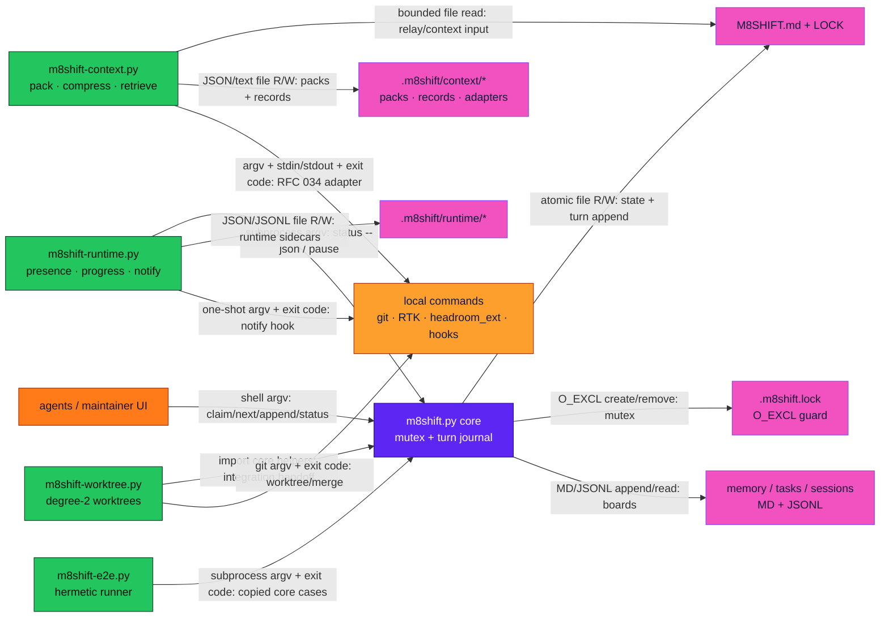
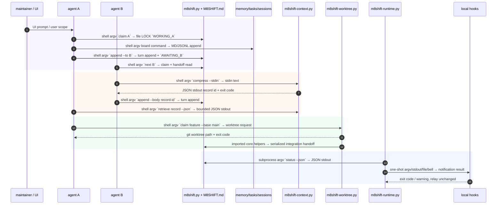

# <i class="fa-solid fa-diagram-project m8-heading-icon" aria-hidden="true"></i> Architecture

M8Shift is a local relay: a passive core owns the pen, while companions observe,
prepare context, notify, or isolate parallel work without becoming a second writer.

::: tip Local by design
Every channel below is local: repository files, shell argv, JSON/stdin-stdout, exit
codes, and git. The **core relay** has no hosted control plane, no network path, and no daemon. (The optional `--with-rtk` / `--with-headroom` installers perform **install-time** downloads, and the RFC 034 adapters run as **pinned argv subprocesses** — v3.40+; runtime stays offline.)
:::

## <i class="fa-solid fa-network-wired m8-heading-icon" aria-hidden="true"></i> Module communication

`RTK` and `headroom_ext` are optional token-usage adapters. See
[Token adapters: RTK and Headroom](./features#token-adapters-rtk-and-headroom).

## <i class="fa-solid fa-people-arrows m8-heading-icon" aria-hidden="true"></i> Inter-application agent flow

## <i class="fa-solid fa-check-double m8-heading-icon" aria-hidden="true"></i> Verified channels

| Channel | Code path |
|---------|-----------|
| agents / maintainer → core | `m8shift.py` command handlers such as `claim`, `next`, `append`, `pause`, `resume` |
| core → relay files | `M8SHIFT.md` state updates guarded by `.m8shift.lock` and atomic writes |
| runtime → core | `m8shift-runtime.py run_core_json()` calls `[python, m8shift.py, ...]` and parses JSON stdout |
| runtime → notifications | one-shot stdout/file/bell/OS/hook tiers; hooks return exit codes and never mutate relay state |
| context → adapters | RFC 034 argv-only runner with bounded stdout/stderr and exit-code handling |
| context → compression store | `compress` writes raw/compact/record files; `retrieve` serves bounded, hash-verified content |
| worktree → git/core | git worktree/merge argv calls plus imported core helpers for serialized integration |
| e2e → core | temp-copy scenarios driven by subprocess argv and exit codes |
