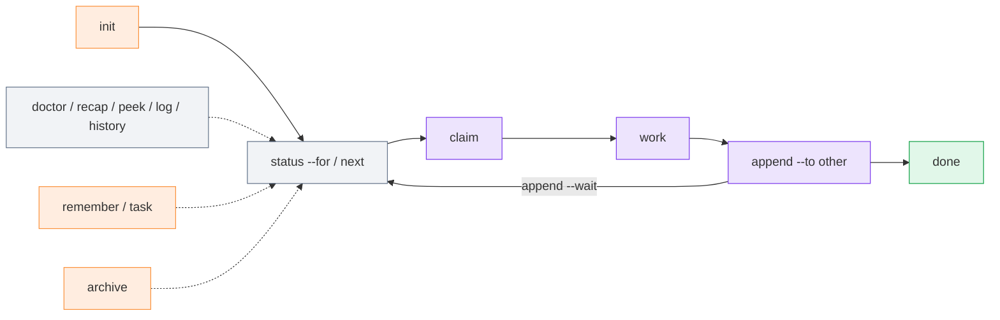

# CLI reference

The CLI is a single file, `m8shift.py` 3.9.0 (Python 3.8+, standard library only).
Run it from a project root.

All commands return [exit code](./exit-codes) `0` on success, `1` on a refusal or
runtime error, and `2` on an argument error. Readiness checks such as `wait --once`,
`next --once`, and `peek` return `3` when the agent should not proceed yet.



*🟣 claim / append / work · 🟢 done · ⚪ status / next / read-only views · 🟠 stored ledgers*

## Shipped commands

### `init`

Generate or regenerate the kit in the current folder.

```bash
python3 m8shift.py init [--name NAME] [--agents a,b,c] [--lang en|fr] [--force]
```

| Flag | Default | Meaning |
| --- | --- | --- |
| `--name` | folder name | project name written into generated files |
| `--agents` | `claude,codex` | relay roster; at least two names; one shared degree-1 pen |
| `--lang` | `en` | language of generated files (`en` or `fr` in the bundled build) |
| `--force` | off | also reset the relay file; otherwise an existing relay is kept |

### `status`

Print the current lock: holder, state, turn, roster, session, UTC timestamps, and
human-facing local-time labels.

```bash
python3 m8shift.py status [--for agent] [--json]
```

- `--for agent` adds the next safe action for that agent.
- `--json` emits machine-readable status with UTC timestamps.

### `doctor`

Run read-only health and lint checks.

```bash
python3 m8shift.py doctor [--lint] [--json] [--severity-min info|warning|error]
```

`--lint` exits non-zero when findings at or above the selected severity exist.

### `recap`

Print a briefing: lock, recent turns, memory notes, and open tasks.

```bash
python3 m8shift.py recap [--turns N] [--memory N] [--tasks N]
```

### `peek`

Read the latest handoff addressed to an agent without claiming the pen.

```bash
python3 m8shift.py peek <agent>
```

It returns `3` if the relay is not waiting for that agent.

### `log`

Show the relay timeline.

```bash
python3 m8shift.py log [--limit N] [--all] [--oneline]
```

`--all` includes archived turns.

### `history`

Show prior sessions from `M8SHIFT.sessions.jsonl`.

```bash
python3 m8shift.py history [--limit N] [--oneline] [--json]
```

### `wait`

Block until it is `<agent>`'s turn.

```bash
python3 m8shift.py wait <agent> [--once] [--interval N]
```

| Flag | Default | Meaning |
| --- | --- | --- |
| `--once` | off | check once and exit — `rc 0` if you may acquire, `rc 3` if not yet |
| `--interval` | `60` | seconds between polls in blocking mode |

`wait` blocks a process; it does not wake an interactive UI. See the
[VS Code guide](/guide/vscode).

### `next`

Safe resumption command: wait if needed, then perform the normal `claim` and print
the latest handoff.

```bash
python3 m8shift.py next <agent> [--once] [--interval N] [--force]
```

`--once` is non-mutating when it is not your turn. `--force` only recovers a stale
`WORKING_*` lock.

### `claim`

Acquire the pen exclusively. This is the only way to start writing.

```bash
python3 m8shift.py claim <agent> [--force]
python3 m8shift.py claim <agent> --check [--files CSV] [--turns N]
```

Re-claiming a lock you already hold refreshes its 30-minute TTL. `--force` reclaims a
stale lock only. `--check` is read-only: it reports readiness and advisory file overlap
without taking the pen.

### `append`

Close your turn and hand the pen to another roster member. Requires that you currently
hold the pen (`state == WORKING_<you>`).

```bash
python3 m8shift.py append <agent> --to <other> \
  [--ask "what the next agent should do"] \
  [--done "what you completed"] \
  [--files "a.py,b.md"] \
  [--body PATH|-] \
  [--wait] [--wait-interval N] \
  [--branch B] [--commit SHA] [--tests "cmd"] \
  [--next "next step"] [--blocked-on "reason"] \
  [--field key=value]
```

`--to` is required and cannot equal the sender. `--body -` reads from stdin. `--wait`
keeps the caller blocked after handoff until its next turn or `DONE`, which prevents
premature UI/automation exits.

### `remember`

Append one durable shared-memory note. It does not require the pen.

```bash
python3 m8shift.py remember <agent> "note"
```

### `task`

Maintain an append-only task ledger. It does not require the pen.

```bash
python3 m8shift.py task add <agent> "description" [--for assignee] [--blocked-on reason]
python3 m8shift.py task done <agent> <id>
python3 m8shift.py task drop <agent> <id>
python3 m8shift.py task list [--all]
python3 m8shift.py task show <id>
```

### `release`

Hand off without recording a numbered turn; this does not increment `turn`.

```bash
python3 m8shift.py release <agent> --to <other> [--force]
```

### `done`

Mark the relay finished (`state: DONE`).

```bash
python3 m8shift.py done <agent> [--force]
```

### `archive`

Move older turns to `M8SHIFT.archive.md`, keeping the lock and the most recent turns.

```bash
python3 m8shift.py archive [--keep N]
```

`--keep` defaults to `6`. Turn #0 is never archived.

## Optional worktree companion

`m8shift-worktree.py` is a separate companion for isolated parallel feature work. It
creates per-task git worktrees and serializes integration back through one integration
pen.

```bash
python3 m8shift-worktree.py claim|done|integrate|drop|status ...
```

Use it when you need parallel branches/worktrees. The core `m8shift.py` relay remains
degree 1 in the shared repository.
