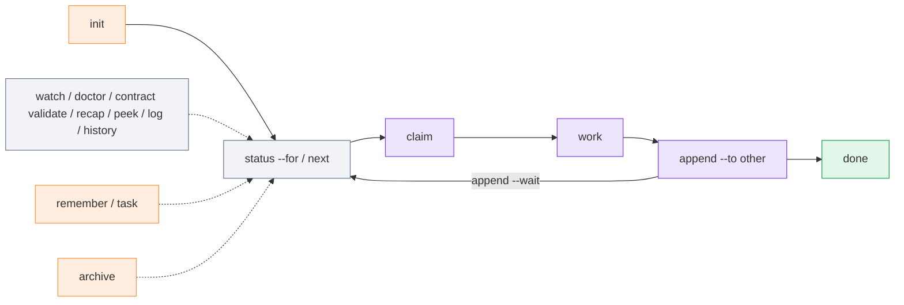

# CLI reference

The CLI is a single file, `m8shift.py` 3.60.0 (Python 3.8+, standard library only — the core; the optional RTK filter and Headroom/Kompress compression adapter are version-pinned via `install.sh --with-rtk` / `--with-headroom` and gated by `--allow-project-local-adapters`).
Run it from a project root.

All commands return [exit code](./exit-codes) `0` on success, `1` on a refusal or
runtime error, and `2` on an argument error. Readiness checks such as `wait --once`,
`next --once`, and `peek` return `3` when the agent should not proceed yet.



*🟣 claim / append / work · 🟢 done · ⚪ status / next / read-only views · 🟠 stored ledgers*

## Shipped commands

### `init`

Generate or regenerate the kit in the current folder.

```bash
python3 m8shift.py init [--name NAME] [--agents a,b,c] [--lang en|fr] [--force] \
  [--companions LIST | --with-runtime ... | --full | --no-companions] \
  [--companion-source DIR] [--force-companions]
```

| Flag | Default | Meaning |
| --- | --- | --- |
| `--name` | folder name | project name written into generated files |
| `--agents` | `claude,codex` | relay roster; at least two names; one shared degree-1 pen |
| `--lang` | `en` | language of generated files (`en` or `fr` in the bundled build) |
| `--force` | off | also reset the relay file; otherwise an existing relay is kept |

#### Companion install

`init` can also copy the selected companion scripts into the kit dir, version-locked to
the core. The copy is idempotent and no-clobber (it refuses an edited or newer local
companion and never downgrades one), atomic, and preflighted before any mutation — a bad
selection exits non-zero with no half-initialized relay. Installed companions are recorded
in a merged `.m8shift/kit.json` manifest, and `doctor` reports missing, skewed, or edited
companions read-only.

| Flag | Default | Meaning |
| --- | --- | --- |
| `--companions` | none | comma-separated companions to copy into the kit dir: `runtime,context,worktree,headroom,i18n,e2e` |
| `--with-runtime` | off | copy `m8shift-runtime.py` |
| `--with-context` | off | copy `m8shift-context.py` |
| `--with-worktree` | off | copy `m8shift-worktree.py` |
| `--with-headroom-companion` | off | copy `m8shift-headroom.py` (the launcher only, not the venv/deps) |
| `--with-i18n` | off | copy `m8shift-i18n.py` |
| `--with-e2e` | off | copy `m8shift-e2e.py` |
| `--full` | off | copy all operational companions (`runtime,context,worktree,headroom,i18n`) |
| `--no-companions` | off | copy no companions (explicit opt-out; cannot be combined with a selection) |
| `--companion-source` | kit dir | directory to copy companions **from** (a release/checkout dir); defaults to the running `m8shift.py` dir |
| `--force-companions` | off | replace an older or edited local companion (never downgrades a newer one) |

### `status`

Print the current lock: holder, state, turn, roster, session, UTC timestamps, and
human-facing local time prefixed by the timezone name/offset when available
(otherwise `local`).

The header also identifies **where** you are: the project name, the working directory
(`cwd`, the real directory the command runs from), and the relay root (`root`), so
multiple open terminals or tabs stay distinguishable. The project label prefers the
name given at `init --name` (persisted on the session start event) and falls back to
the relay-root folder name; `cwd` and `root` diverge correctly when the tool is invoked
from a subdirectory.

```bash
python3 m8shift.py status [--for agent] [--json]
```

- `--for agent` adds the next safe action for that agent.
- `--json` emits machine-readable status with UTC timestamps, including the same
  `project`, `cwd`, and `root` keys as the human header.

### `watch`

Continuously reprint [`status`](#status) until interrupted — a live, read-only view of
the relay as it evolves. It never writes, claims, or steals the pen.

```bash
python3 m8shift.py watch [--for agent] [--interval N] [--clear] [--changes-only]
```

- `--interval N` sets the refresh seconds; `--changes-only` reprints only on a change;
  `--clear` redraws in place.
- Each refresh banner shows the project name and the working directory, so a `watch`
  left running in another terminal or tab identifies itself at a glance.

### `doctor`

Run read-only health and lint checks.

```bash
python3 m8shift.py doctor [--lint] [--json] [--security] [--contracts] \
  [--install] [--source DIR] [--severity-min info|warning|error]
```

`--lint` exits non-zero when findings at or above the selected severity exist.
`--security` adds local security checks. `--contracts` adds Stage-4 contract
validation findings. `--install` (v3.52.0) adds read-only post-install
verification: Python floor, core presence, checksum-manifest validity and
drift, companion status, and optional helper states — a missing optional
helper is `info`, never a warning, so a healthy minimal install stays green.
`--source DIR` compares the local core against a newer source copy and adds
a `workspace.dirty_worktree` advisory when the checkout has uncommitted
changes.

### `contract validate`

Validate Stage-4 handoff contracts in the turn journal. This is read-only: it never
claims, routes, grants permissions, runs tests, or mutates the `LOCK`.

```bash
python3 m8shift.py contract validate [--strict] [--json] [--all] \
  [--severity-min info|warning|error]
```

`schema=stage4.v1` activates validation for a turn. Default mode reports findings and
returns success unless the command itself fails. `--strict` exits non-zero when findings
at or above the selected severity exist.

### `recap`

Print a **current-session briefing** — the lock, recent turns, memory headlines, and open tasks —
what an agent reads when it resumes. (`recap` is the *current* session; [`history`](#history) is the
log of *past* ones.)

```bash
python3 m8shift.py recap [--turns N] [--memory N] [--tasks N]
python3 m8shift.py recap --turns 6 --memory 5 --tasks 5
```

### `peek`

Read the latest handoff addressed to an agent without claiming the pen.

```bash
python3 m8shift.py peek <agent>
```

It returns `3` if the relay is not waiting for that agent.

### `log`

Show the relay timeline.

```bash
python3 m8shift.py log [--limit N] [--all] [--oneline]
```

`--all` includes archived turns.

### `history`

Show **prior sessions** (start / reset / done) folded from the append-only
`M8SHIFT.sessions.jsonl` ledger — a readable, reproducible session log, not an automatic summary.

```bash
python3 m8shift.py history [--limit N] [--oneline] [--json]
python3 m8shift.py history --oneline
python3 m8shift.py history --json
```

### `wait`

Block until it is `<agent>`'s turn.

```bash
python3 m8shift.py wait <agent> [--once] [--interval N]
```

| Flag | Default | Meaning |
| --- | --- | --- |
| `--once` | off | check once and exit — `rc 0` if you may acquire, `rc 3` if not yet |
| `--interval` | `60` | seconds between polls in blocking mode |

`wait` blocks a process; it does not wake an interactive UI. See the
[VS Code guide](/guide/vscode).

### `next`

Safe resumption command: wait if needed, then perform the normal `claim` and print
the latest handoff.

```bash
python3 m8shift.py next <agent> [--once] [--interval N] [--force]
```

`--once` is non-mutating when it is not your turn. `--force` only recovers a stale
`WORKING_*` lock.

### `claim`

Acquire the pen exclusively. This is the only way to start writing.

```bash
python3 m8shift.py claim <agent> [--force|--refresh]
python3 m8shift.py claim <agent> --check [--files CSV] [--turns N]
```

Re-claiming a lock you already hold refreshes its 30-minute TTL — the **manual heartbeat** for a
long `WORKING_<you>` (the agent or a headless wrapper re-runs it; no daemon does it for you).
`--force` reclaims a stale lock only. `--refresh` (v3.46) only **extends your own `WORKING` lock** — refused otherwise, mutually exclusive with `--force`; automated runners must heartbeat with `--refresh`, never a plain claim. `--check` is read-only: it reports readiness and advisory
file overlap without taking the pen.

### `append`

Close your turn and hand the pen to another roster member. Requires that you currently
hold the pen (`state == WORKING_<you>`).

```bash
python3 m8shift.py append <agent> --to <other> \
  [--ask "what the next agent should do"] \
  [--done "what you completed"] \
  [--files "a.py,b.md"] \
  [--body PATH|-] \
  [--wait] [--wait-interval N] \
  [--branch B] [--commit SHA] [--tests "cmd"] \
  [--next "next step"] [--blocked-on "reason"] \
  [--schema stage4.v1] [--relation review_request|review_result|handoff|escalation] \
  [--role-from role] [--role-to role] \
  [--requires "required checks"] [--expected-output "deliverable"] \
  [--evidence "tests or commands"] \
  [--decision approve|revise|reject|waive] [--waiver-reason "why"] \
  [--permissions "intent"] \
  [--field key=value]
```

`--to` is required and cannot equal the sender. `--body -` reads from stdin. `--wait`
keeps the caller blocked after handoff until its next turn or `DONE`, which prevents
premature UI/automation exits.

Stage-4 flags serialize to plain advisory turn fields. They are checked only by
`contract validate` / `doctor --contracts`; the relay still routes exclusively on the
`LOCK`.

### `remember`

Append one durable shared-memory note. It does not require the pen.

```bash
python3 m8shift.py remember <agent> "note"
```

### `task`

Maintain an append-only task ledger. It does not require the pen.

```bash
python3 m8shift.py task add <agent> "description" [--for assignee] [--blocked-on reason]
python3 m8shift.py task done <agent> <id>
python3 m8shift.py task drop <agent> <id>
python3 m8shift.py task list [--all]
python3 m8shift.py task show <id>
```

### `release`

Hand off without recording a numbered turn; this does not increment `turn`.

```bash
python3 m8shift.py release <agent> --to <other> [--force]
```

### `done`

Mark the relay finished (`state: DONE`).

```bash
python3 m8shift.py done <agent> [--force]
```

### `pause` / `resume`

Park an open session with no active work, then resume it only when the maintainer
assigns new scope.

```bash
python3 m8shift.py pause <holder> --reason "no further assigned work"
python3 m8shift.py resume <agent> --reason "user assigned new scope"
python3 m8shift.py next <agent> --resume --reason "user assigned new scope"
```

`PAUSED` has `holder=none` and no expiry. `wait <agent>` does not treat it as the
agent's turn; resumption is explicit.

### `archive`

Move older turns to `M8SHIFT.archive.md`, keeping the lock and the most recent turns.

```bash
python3 m8shift.py archive [--keep N]
```

`--keep` defaults to `6`. Turn #0 is never archived.

## Optional worktree companion

[`m8shift-worktree.py`](/guide/worktree-toolbox) is a separate companion for
isolated parallel feature work. It creates per-task git worktrees and serializes
integration back through one integration pen.

```bash
python3 m8shift-worktree.py claim|done|integrate|drop|status ...
```

Use it when you need parallel branches/worktrees. The core `m8shift.py` relay remains
degree 1 in the shared repository.

## Optional runtime companion

`m8shift-runtime.py` is a separate local companion for provider registry files,
roles/workflows, approvals, reports, live presence, operator inbox, progress, runtime
status, diagnostics, lane ownership, no-progress checks, and bounded runtime sidecar
retention.

```bash
python3 m8shift-runtime.py init
python3 m8shift-runtime.py providers list
python3 m8shift-runtime.py watch codex --no-progress-warn-after 300
python3 m8shift-runtime.py progress codex --message "tests running"
python3 m8shift-runtime.py status-runtime --agent codex
python3 m8shift-runtime.py doctor --json
python3 m8shift-runtime.py retention prune --keep 1000
```

::: warning Advisory companion only
Runtime sidecars never grant the pen, never edit `M8SHIFT.md` directly, never require
network access, and never auto-force a holder. They are removable local observability
files under `.m8shift/`.
:::
