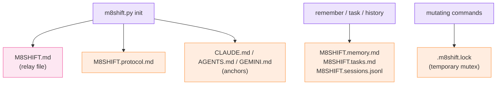

# Generated files

`m8shift.py init` writes the core relay files at the project root. Other ledgers are
created on demand by the command that owns them. Generated files use the `M8SHIFT.*`
names.

*🟣 init · 🩷 relay file · 🟠 generated files*

| File | Purpose |
| --- | --- |
| `M8SHIFT.md` | living lock, workflow state, and the immutable turn journal |
| `M8SHIFT.protocol.md` | the shared protocol, generated from `m8shift.py` |
| `M8SHIFT.archive.md` | older turns moved here by `archive` (created on demand) |
| `M8SHIFT.memory.md` | shared-memory notes appended by `remember` (created on demand) |
| `M8SHIFT.tasks.md` | append-only task events appended by `task` (created on demand) |
| `M8SHIFT.sessions.jsonl` | session start/done events for `history` (created on demand) |
| `.m8shift.lock` | temporary inter-process mutation lock (`O_EXCL`) |
| `CLAUDE.md` | Claude anchor (protocol stanza injected at the top) |
| `AGENTS.md` | Codex and generic-agent anchor; `AGENTS.override.md` is synced if present |
| `GEMINI.md` | Gemini anchor, when `gemini` is in the roster |

::: tip Idempotent anchors
The anchor stanza is idempotent: the prior file is backed up to `<anchor>.m8shift.bak`
before injection.
:::

::: tip On-demand ledgers
`init` does not create the memory, task, archive, or session files unless the relevant
commands need them. Their absence means "no entries yet", not an error.
:::
