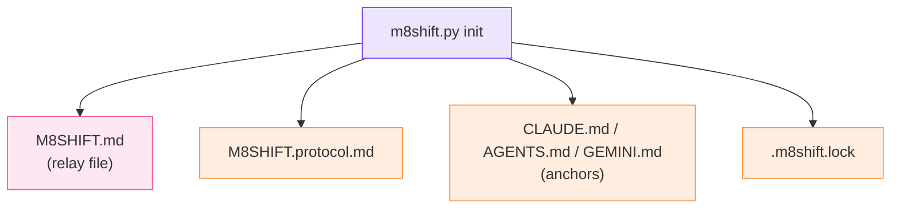

# Generated files

`m8shift.py init` writes a small, fixed set of files at the project root. New projects
use the `M8SHIFT.*` names; projects created before the rename keep their `COWORK.*`
files, which are detected and read automatically.

*🟣 init · 🩷 relay file · 🟠 generated files*

| File | Purpose |
| --- | --- |
| `M8SHIFT.md` | living lock, workflow state, and the immutable turn journal |
| `M8SHIFT.protocol.md` | the shared protocol, generated from `m8shift.py` |
| `M8SHIFT.archive.md` | older turns moved here by `archive` (created on demand) |
| `.m8shift.lock` | inter-process mutation lock (`O_EXCL`) |
| `CLAUDE.md` | Claude anchor (protocol stanza injected at the top) |
| `AGENTS.md` | Codex and generic-agent anchor; `AGENTS.override.md` is synced if present |
| `GEMINI.md` | Gemini anchor, when `gemini` is in the roster |

::: tip Legacy compatibility
On existing projects the equivalents `COWORK.md`, `COWORK.protocol.md`,
`COWORK.archive.md` and `.cowork.lock` keep working — `m8shift.py` reads both the new
`M8SHIFT:*` and the old `COWORK:*` markers. The anchor stanza is idempotent: the prior
file is backed up to `<anchor>.cowork.bak` before injection.
:::

::: warning Not generated
There is no `M8SHIFT.memory.md`. Shared memory (`remember` / `recap`) is a specified
future feature, not part of the current `init` output — see the [roadmap](/roadmap).
:::
