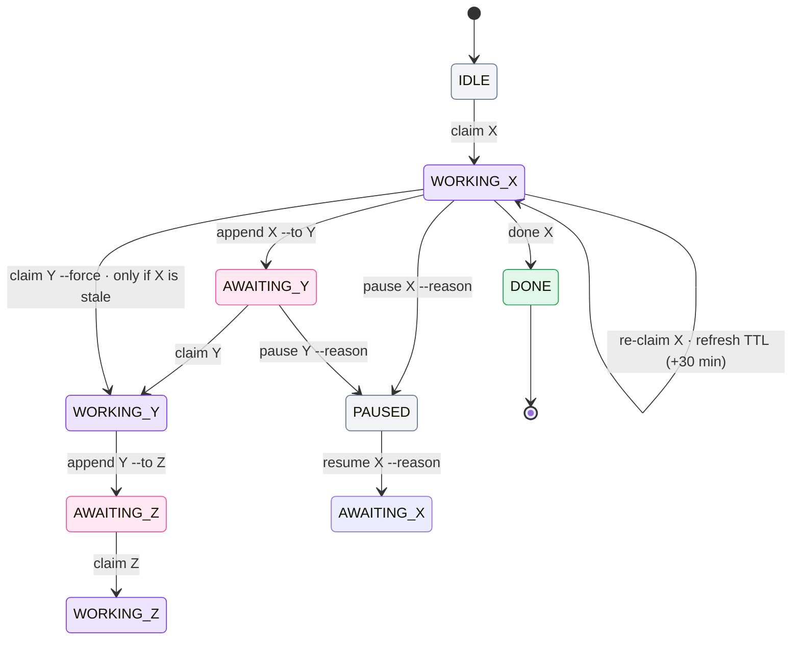

# State model

All relay state lives in one place: the **lock block** at the top of `M8SHIFT.md`,
between `<!-- M8SHIFT:LOCK:BEGIN -->` and
`<!-- M8SHIFT:LOCK:END -->`. It is plain `key: value` lines, one per field, so it stays
greppable and diffable.

```text
<!-- M8SHIFT:LOCK:BEGIN -->
holder: claude
state: WORKING_CLAUDE
agents: claude,codex
turn: 3
since: 2026-06-22T18:00:00Z
expires: 2026-06-22T18:30:00Z
note: -
lang: en
<!-- M8SHIFT:LOCK:END -->
```

## Lock fields

| Field | Values | Meaning |
| --- | --- | --- |
| `holder` | an active agent \| `none` | who currently holds the pen |
| `state` | `IDLE` \| `WORKING_<X>` \| `AWAITING_<X>` \| `PAUSED` \| `DONE` | the relay state |
| `agents` | CSV, e.g. `claude,codex,gemini` | active roster; any listed agent may receive the degree-1 pen |
| `turn` | integer | number of the last closed turn |
| `since` | ISO-8601 UTC | when the current state began |
| `expires` | ISO-8601 UTC \| `-` | TTL deadline; carries a date **only** during `WORKING_*` (30 min) |
| `note` | text \| `-` | optional short note |
| `lang` | `en` \| `fr` | language of generated output |

## States

- **`IDLE`** — the pen is free; any roster member may claim it.
- **`WORKING_<X>`** — agent X holds the pen and is the only one allowed to write.
- **`AWAITING_<X>`** — X has been handed the pen and is expected to claim and continue.
- **`PAUSED`** — the session stays open with `holder=none`; no agent may claim until
  the maintainer explicitly resumes with new scope.
- **`DONE`** — the relay is finished.

## Transitions



*🟣 working · 🩷 awaiting · ⚪ idle/paused · 🟢 done*

- `claim` is the only acquisition and is **exclusive**: two simultaneous claims yield
  exactly one winner.
- `append` is accepted **only** from `WORKING_<self>`, and `--to` must be another
  roster member.
- `claim --force` reclaims a lock **only** once it is past `expires` (stale); it is
  refused on a live lock.
- `pause` parks an open session without a holder when there is no active task.
  `resume` / `next --resume` requires explicit new user scope.
- The `WORKING_<self>` TTL is **30 minutes**. The holder refreshes it by re-running
  `claim <self>`, which resets `expires` to `now + 30 min` — a **manual heartbeat**, run by the
  agent or a headless wrapper. M8Shift runs **no background daemon**: nothing renews the lock for
  you, and once a lock is past `expires` it simply becomes reclaimable with `claim --force`.
- Timestamps are stored in UTC. Human-facing commands also show local time prefixed
  by the timezone name/offset when available (otherwise `local`); JSON keeps UTC
  values only.

::: tip Degree 1 by default
The core relay supports an N-agent roster, but still only one shared pen. Parallel
feature work is handled by the optional [worktree companion](/guide/worktree-toolbox),
not by simultaneous writes inside the same working tree.
:::
