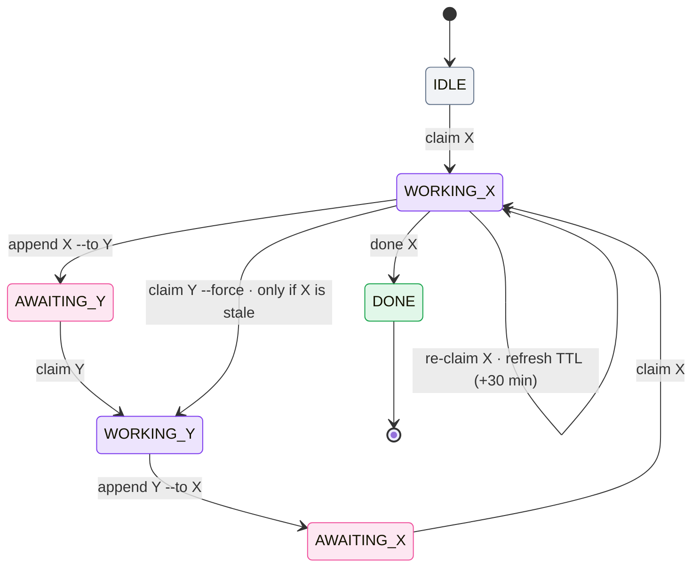

# State model

All relay state lives in one place: the **lock block** at the top of `M8SHIFT.md`
(`COWORK.md` on legacy projects), between `<!-- M8SHIFT:LOCK:BEGIN -->` and
`<!-- M8SHIFT:LOCK:END -->`. It is plain `key: value` lines, one per field, so it stays
greppable and diffable.

```text
<!-- M8SHIFT:LOCK:BEGIN -->
holder: claude
state: WORKING_CLAUDE
agents: claude,codex
turn: 3
since: 2026-06-22T18:00:00Z
expires: 2026-06-22T18:30:00Z
note: -
lang: en
<!-- M8SHIFT:LOCK:END -->
```

## Lock fields

| Field | Values | Meaning |
| --- | --- | --- |
| `holder` | an active agent \| `none` | who currently holds the pen |
| `state` | `IDLE` \| `WORKING_<X>` \| `AWAITING_<X>` \| `DONE` | the relay state |
| `agents` | CSV, e.g. `claude,codex` | the roster; the **first two** are the active pair |
| `turn` | integer | number of the last closed turn |
| `since` | ISO-8601 UTC | when the current state began |
| `expires` | ISO-8601 UTC \| `-` | TTL deadline; carries a date **only** during `WORKING_*` (30 min) |
| `note` | text \| `-` | optional short note |
| `lang` | `en` \| `fr` | language of generated output |

## States

- **`IDLE`** — the pen is free; anyone in the pair may claim it.
- **`WORKING_<X>`** — agent X holds the pen and is the only one allowed to write.
- **`AWAITING_<X>`** — X has been handed the pen and is expected to claim and continue.
- **`DONE`** — the relay is finished.

## Transitions



*🟣 working · 🩷 awaiting · ⚪ idle · 🟢 done*

- `claim` is the only acquisition and is **exclusive**: two simultaneous claims yield
  exactly one winner.
- `append` is accepted **only** from `WORKING_<self>`, and `--to` must be the other agent.
- `claim --force` reclaims a lock **only** once it is past `expires` (stale); it is
  refused on a live lock.

::: tip Specified, not shipped
A richer per-task state machine (`PENDING`, `READY`, `BLOCKED`, `NEEDS_REVIEW`,
`APPROVED`…) belongs to the multi-agent direction on the [roadmap](/roadmap), not the
current relay.
:::
