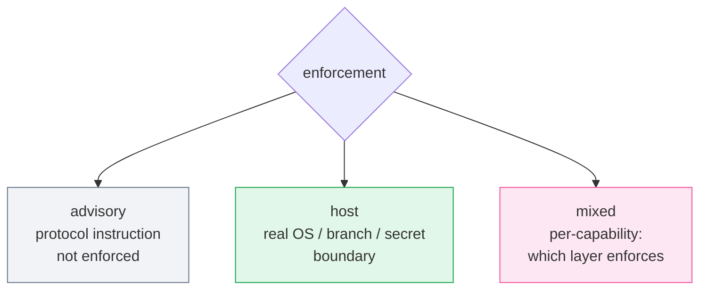

# Permissions

Example:

```yaml
permissions:
  enforcement: host
  allow:
    - repository.read
    - assets.write
    - image.generate
  deny:
    - source_code.write
    - secrets.read
    - remote.push
```

`advisory` means the agent is instructed to comply. `host` means the environment
actually enforces the capability boundary. `mixed` requires each capability to state
which layer enforces it.



*⚪ advisory (not a real boundary) · 🟢 host (real boundary) · 🩷 mixed*
