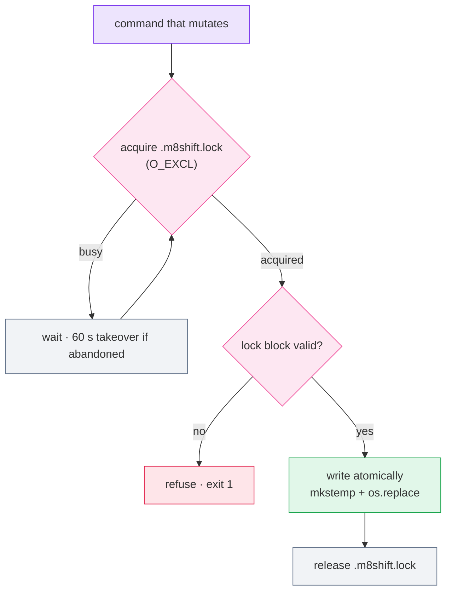

# Threat model

M8Shift is a **cooperative, advisory** coordination layer. It mitigates *coordination
errors* between agents that follow the protocol. It is not a sandbox and does not contain
a malicious or compromised agent — that is the host's job (filesystem permissions,
branch protection, secret scoping).

Since v3.59.0 the repository also ships a formal
[OWASP LLM Top 10 / MITRE ATLAS mapping](https://github.com/M8Shift/M8Shift/blob/main/docs/en/security-threat-model.md)
with explicit out-of-scope calls, backed by an executable conformance suite:
each mapped technique has a named behavioral test that fails when its invariant
breaks (mutation-verified). See also
[SECURITY.md](https://github.com/M8Shift/M8Shift/blob/main/SECURITY.md) for the
private reporting channel and the automated checks (CodeQL, Bandit, ShellCheck,
actionlint, Scorecard, Dependabot, and the anti-leak data-hygiene gates).

Every command that mutates state goes through the same serialised path:

*🟣 agents · 🩷 the pen · 🟢 ok · 🔴 refusal · ⚪ wait*

| Threat | Mitigation |
| --- | --- |
| Two agents claim the pen at once | `claim` is exclusive via an `O_EXCL` lock file; exactly one wins, the other waits |
| A read-modify-write races another process | Every mutation is serialised by `.m8shift.lock` and written atomically (`mkstemp` + `os.replace`) |
| A crashed holder leaves the lock file behind | The lock file carries an ownership token and is reclaimed after 60 s |
| A holder stalls and blocks the relay | The lock has a 30-minute TTL; once `expires` passes, the other agent may `claim --force` |
| Marker injection in a turn (fake `M8SHIFT:TURN`/`LOCK`/`STANZA`) | Field values reject reserved markers; free-text bodies neutralise them |
| Newline injection in single-line fields | `from`/`to`/`ask`/`done`/`files` reject line breaks |
| A handoff targets an agent outside the roster | `--to` is validated against the declared roster; unknown agents are refused (exit `1`) |
| A corrupted or invalid lock block | The lock is parsed and validated before any write; invalid state is refused, not patched |

## What M8Shift does **not** defend against

- A process that ignores the protocol and edits files directly — the lock is advisory.
- An agent lying about tests, commits, or pushes — those claims must be verified by the
  agent or host that ran them.
- OS-level access: advisory permissions are protocol instructions, not enforcement. See
  [permissions](./permissions).
- Network filesystems: `O_EXCL` and atomic rename are less reliable on NFS; target local
  disk.
