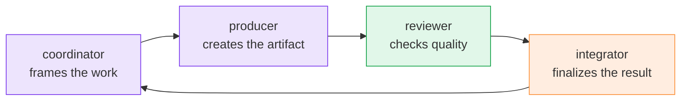

# Use Cases

M8Shift is designed for workflows where a single AI assistant is not enough, or where
splitting the work between specialized roles produces better results.

Instead of asking one agent to do everything in one pass, M8Shift lets multiple AI
teammates collaborate with clear ownership, handoffs, task notes, and validation.

  <a class="m8-usecase-image-card" href="#write-a-book">
    
    
      <i class="fa-solid fa-pen-fancy" aria-hidden="true"></i><strong>Writing</strong>
      Coordinate planning, drafting, reviewing, editing, and manuscript cleanup.
    
  </a>
  <a class="m8-usecase-image-card" href="#build-software">
    
    
      <i class="fa-solid fa-terminal" aria-hidden="true"></i><strong>Software</strong>
      Split planning, implementation, review, tests, docs, and release notes.
    
  </a>
  <a class="m8-usecase-image-card" href="#generate-documentation">
    
    
      <i class="fa-solid fa-book-open" aria-hidden="true"></i><strong>Documentation</strong>
      Turn scattered project knowledge into guides, references, and onboarding material.
    
  </a>
  <a class="m8-usecase-image-card" href="#design-a-website">
    
    
      <i class="fa-solid fa-layer-group" aria-hidden="true"></i><strong>Websites</strong>
      Coordinate information architecture, copy, docs, FAQ, and implementation-ready content.
    
  </a>
  <a class="m8-usecase-image-card" href="#create-marketing-and-product-content">
    
    
      <i class="fa-solid fa-bullhorn" aria-hidden="true"></i><strong>Marketing</strong>
      Keep product messaging consistent across pages, launch notes, and comparisons.
    
  </a>
  <a class="m8-usecase-image-card" href="#research-and-synthesis">
    
    
      <i class="fa-solid fa-magnifying-glass-chart" aria-hidden="true"></i><strong>Research</strong>
      Gather sources, compare approaches, identify risks, and produce decision notes.
    
  </a>
  <a class="m8-usecase-image-card" href="#review-and-quality-control">
    
    
      <i class="fa-solid fa-shield-halved" aria-hidden="true"></i><strong>Review</strong>
      Separate production from validation so one agent is not the only approver.
    
  </a>
  <a class="m8-usecase-image-card" href="#automate-multi-step-workflows">
    
    
      <i class="fa-solid fa-gears" aria-hidden="true"></i><strong>Automation</strong>
      Break complex work into turns, track progress, validate output, and finish cleanly.
    
  </a>

## Write a Book

Use M8Shift to organize long-form writing projects with several roles:

- a coordinator defines the concept, audience, constraints, and chapter plan;
- a writer drafts sections or chapters;
- a reviewer checks structure, pacing, consistency, and missing arguments;
- an editor polishes the final Markdown or manuscript files.

Typical workflow:

- define the book concept and target audience;
- generate a detailed outline;
- write chapters section by section;
- keep tone, terminology, and structure consistent;
- review clarity, pacing, and factual claims;
- prepare export-ready Markdown or manuscript files.

M8Shift helps avoid the "one huge prompt, one chaotic answer" pattern by making each
turn narrow, traceable, and reviewable.

## Build Software

M8Shift can coordinate coding work across specialized AI roles:

- a planner breaks down the feature;
- a coder implements changes;
- a reviewer inspects the diff;
- a tester proposes or runs validation steps;
- an integrator prepares the final handoff, commit notes, or release text.

Typical workflow:

- analyze the repository;
- define the task plan;
- create or update source files;
- write or update tests;
- review diffs and edge cases;
- detect regressions;
- prepare commit messages and documentation.

This fits automation scripts, internal tools, websites, CLI utilities, and larger
projects where correctness matters more than a single fast answer.

## Generate Documentation

M8Shift can turn scattered project information into structured documentation.

Typical workflow:

- generate project documentation;
- create setup and installation guides;
- write API or CLI references;
- maintain changelogs and release notes;
- document architecture decisions;
- produce onboarding material for contributors;
- run a technical review before publishing.

The important split is simple: one role writes, another verifies. Documentation still
needs maintenance, but the review loop makes drift easier to catch.

## Design a Website

M8Shift is useful for Markdown-based static sites and developer documentation sites.

Typical workflow:

- define the site structure;
- write landing page copy;
- create use case pages;
- draft documentation pages;
- generate FAQ sections;
- review messaging consistency;
- prepare content for VitePress, Astro, Docusaurus, or a similar framework.

One agent can focus on information architecture, another on copy, another on technical
accuracy, and another on implementation details.

## Create Marketing and Product Content

Use M8Shift when product messaging must stay consistent across pages and formats.

Typical workflow:

- write landing pages;
- create product descriptions;
- generate launch announcements;
- draft comparison pages;
- prepare social posts;
- produce release notes;
- adapt tone for different audiences.

Each role can focus on a different angle: clarity, persuasion, technical accuracy, or
brand consistency.

## Research and Synthesis

M8Shift can coordinate research workflows where information must be collected,
summarized, compared, and turned into usable output.

Typical workflow:

- gather source material;
- extract key points;
- compare approaches;
- identify risks and trade-offs;
- produce summaries;
- generate decision notes;
- prepare structured reports.

This is useful for technical research, product decisions, competitive analysis, and
internal knowledge management.

## Review and Quality Control

M8Shift separates production from validation. The agent that creates an artifact does
not have to be the only one approving it.

Typical workflow:

- review generated code;
- check documentation accuracy;
- validate writing style;
- detect missing requirements;
- compare output against project rules;
- request corrections before finalization.

The goal is fewer unchecked assumptions, fewer missing requirements, and a clearer
record of what was approved or sent back for revision.

## Automate Multi-Step Workflows

M8Shift is useful when a task needs several steps, different skills, or controlled
delegation between agents.

Typical workflow:

- split a complex request into smaller tasks;
- assign each task to the right role or agent;
- track progress in the task ledger;
- collect outputs;
- validate results;
- produce the final deliverable.

This makes M8Shift suitable for content production, software development,
documentation maintenance, website preparation, research, and project coordination.

## Why It Matters

Most AI tools make it easy to ask one assistant for everything at once. M8Shift takes a
different approach: define roles, separate responsibilities, control the work window,
and validate outputs.

That structure matters when tasks become too large, too sensitive, or too complex for a
single prompt.
